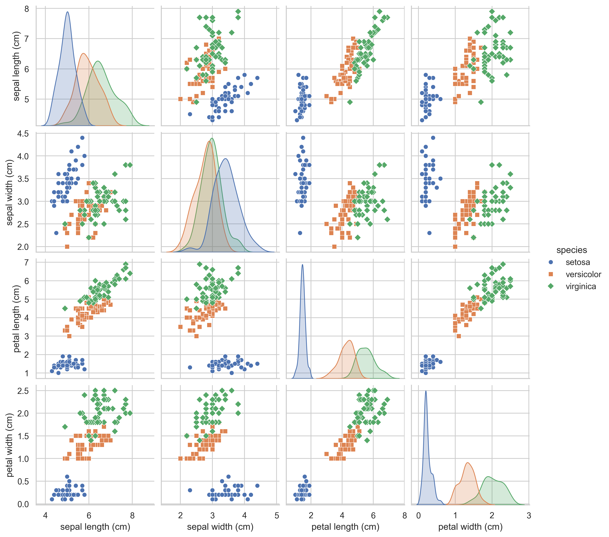

# IRIS Dataset KNN Classifier (PyTorch Implementation)

KNN算法

**部分基于AI完成，不过以认真学习并检查过**

---

## 项目结构

本项目采用模块化的工程结构：

```text
iris_knn_project/
├── images/                  # 运行可视化脚本后生成的图表文件夹
├── models/                  # 模型权重保存目录
│   └── best_knn_model.pth   # 训练后生成的模型文件 (包含训练数据与最佳 K 值)
├── src/                     # 核心源代码目录
│   ├── __init__.py          
│   ├── data_loader.py       # 负责数据集的加载、张量转换与划分
│   ├── model.py             # KNN 算法的核心面向对象实现 (纯 PyTorch 张量计算)
│   └── metrics.py           # 模型评估指标 (如准确率计算)
├── config.py                # 全局配置 (管理路径、随机种子与超参数候选值)
├── visualize.py             # 数据可视化脚本 (生成特征散点图矩阵)
├── train.py                 # 训练主入口：执行验证集调优并保存最佳模型
├── evaluate.py              # 测试主入口：加载持久化模型，并在测试集上输出最终成绩
└── README.md                # 项目说明文档
```

## 环境依赖

在运行本项目之前，请确保 Python 环境中安装了以下依赖库：

```bash
pip install torch scikit-learn pandas matplotlib seaborn
```

------

## 快速开始

本项目分为“训练与调优”和“最终测试”两个独立的步骤

### 第 0 步：数据可视化 (EDA)

执行 `visualize.py`。该脚本会提取数据集的 4 个特征，绘制特征间的两两散点图矩阵（Pairplot），并按类别着色。生成的超高清图表将自动保存在 `./images` 目录下，帮助直观理解数据的可分性。

```bash
python visualize.py
```

- **sepal length**: 花萼长度
- **sepal width**: 花萼宽度
- **petal length**: 花瓣长度
- **petal width**: 花瓣宽度

图中可以看出区分度还是比较大的



### 第一步：寻找最佳 K 值并保存模型

执行 `train.py`。该脚本会自动加载数据，划分为训练集、验证集和测试集，并在**验证集**上遍历 `config.py` 中的候选 K 值，寻找准确率最高的超参数，最后将最佳模型保存到 `models/` 目录下。

```bash
python train.py
```

### 第二步：在测试集上进行期末

执行 `evaluate.py`。该脚本会直接从 `models/knn_model.pth` 中加载模型状态和最佳 K 值，并对之前完全未参与运算的**测试集**进行最终预测，输出最终结果。

```bash
python evaluate.py
```

------

## 算法

- 欧氏距离：求差、平方、相加、开根号
- 惰性学习：只需要保存训练数据作为模型（实际上是因为数据集比较小）

## 结果

`RANDOM_SEED = 42`

```bash
python train.py
loading data

find the best K

当 K=1 时，验证集准确率为: 90.00%
当 K=3 时，验证集准确率为: 93.33%
当 K=5 时，验证集准确率为: 93.33%
当 K=7 时，验证集准确率为: 93.33%
当 K=9 时，验证集准确率为: 93.33%

最佳 K 值为 3，生成模型
最终模型保存至：./models\knn_model.pth
```

```bash
python evaluate.py
获取测试集数据
从 ./models\knn_model.pth 加载模型
记录的最佳 K 值为: 3

对测试集进行预测
====================
模型在测试集上的准确率为: 100.00%
====================
```

- 准确率100%绝大部分情况不会出现，这里100%是因为IRIS数据少，数据极其干净，同时三种花的特征区分度非常高

`RANDOM_SEED = 7`

```bash
python train.py   
loading data

find the best K

当 K=1 时，验证集准确率为: 96.67%
当 K=3 时，验证集准确率为: 96.67%
当 K=5 时，验证集准确率为: 96.67%
当 K=7 时，验证集准确率为: 96.67%
当 K=9 时，验证集准确率为: 100.00%

最佳 K 值为 9，生成模型
最终模型保存至：./models\knn_model.pth
```

```bash
python evaluate.py
获取测试集数据
从 ./models\knn_model.pth 加载模型
记录的最佳 K 值为: 9

对测试集进行预测
====================
模型在测试集上的准确率为: 90.00%
====================
```

